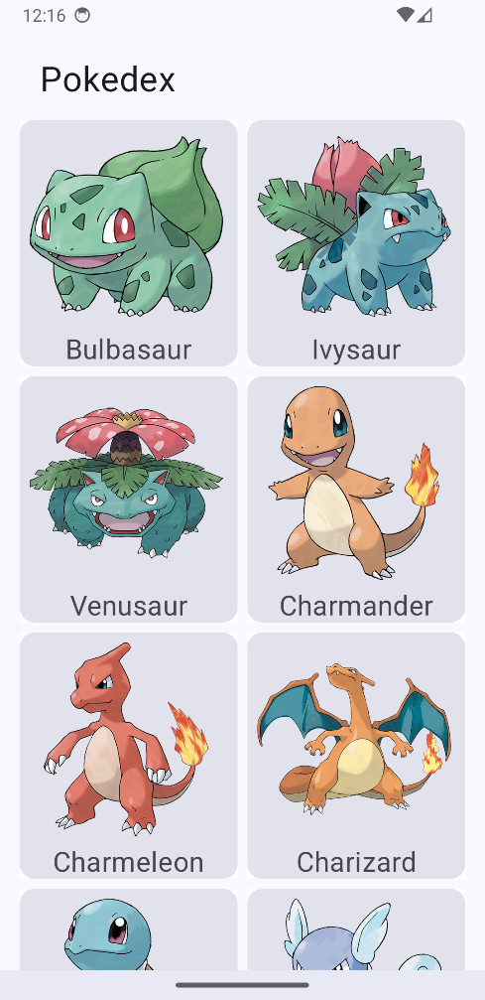

# Pokedex App

Android app simulating a Pokedex: showing a list of Pokemons and their details.
The project is estructured with Hexagonal Architecture, MVVM, Jetpack Compose, Retrofit, Multi module and more.

* * *

* ## What has been done:
  * List of Pokemons fetched from the api. [endpoint](https://pokeapi.co/api/v2/pokemon)
  * Loading indicator when waiting API response.
  * Handling errors (e.g. If there is no connection)
  * Pokemon detail screen showing more info about the pokemon, such as its Weight, Height, Base Stats, Types, etc.
  * Pagination on the list of Pokemons.

* ## What are the key concepts of this project:
  * Hexagonal Architecture
  * Jetpack Compose
  * Multi Module project
  * Jetpack Compose Navigation
  * ViewModel

* ## What libraries has been used:
  * Retrofit - Interface and client to the API, has a good integration with Kotlin Coroutines
  * OkHttp - To give support to Retrofit
  * Gson - Converts JSON to objects and objects to JSON
  * Jetpack ViewModel - To support reactive states
  * Kotlin Coroutines - To make asynchronous calls
  * Dagger/Hilt - Dependency injection
  * Compose Coil - To load images
  * Mockk - create mocked objects when testing
  * JUnit - Tests

* * *
* ## Why Hexagonal Architecture?
    * To create a flow of dependencies pointing to inwards (from Modules to the Domain). So our domain is free from dependencies and we can focus on business logic without worrying about Android technical stuff.
      

* ## Demonstration
*  
*  
*  
*  

* * *
* ## Email
* E-mail: matheusfelipecorreaalves@gmail.com
